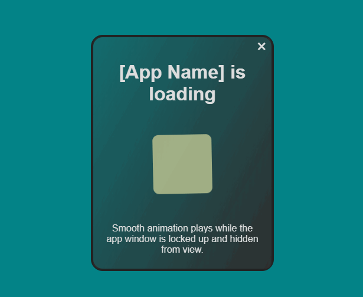

# NW.js Splash Screen Example

This is a demo of the [NW-Splasher](https://github.com/nwutils/nw-splasher) library. Check it out to see its full API.

Demo shows a splash screen until the main application loads.

Splash screen and app are separate instances, meaning:

* Splash screen animations will play smoothly as the app loads
* Splash screen window can be closed without effecting the app loading/showing (Not parent-childed)
